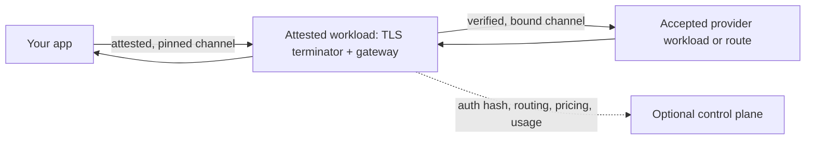

# Private AI Gateway

**Call the LLM APIs you already know. Verify who can read the request before
you send it.**

Private AI Gateway is an OpenAI- and Anthropic-compatible gateway for private
inference. It runs inside a trusted execution environment (TEE), verifies the
confidential provider path selected for the model, and gives the client
evidence it can check independently.

This repository contains the Rust reference implementation of
[Attested Confidential Inference (ACI)](spec/aci.md). It is a developer
preview.

## Try it

Install Private AI Proxy's CLI (macOS, Linux, or Windows):

```bash
npm install --global private-ai-proxy
```

[Other installation options](docs/private-ai-proxy-install.md) include Homebrew,
desktop packages, and native install scripts. You also need system `curl` for
the request below.

Then call Chat Completions as usual. Replace `YOUR_API_KEY` and `MODEL_ID`
with values from your provider:

```bash
pap curl https://tee.redpill.ai/v1/chat/completions -- \
  --fail-with-body \
  --no-buffer \
  --header "Authorization: Bearer YOUR_API_KEY" \
  --header "content-type: application/json" \
  --data-binary '{
    "model": "MODEL_ID",
    "messages": [{"role": "user", "content": "Why is this request private?"}],
    "stream": true,
    "provider": {"aci_verified": true}
  }'
```

Before curl sends the request body, `pap` verifies a fresh hardware quote,
the measured gateway workload, and the TLS key it reached. It pins curl to
that key and prints a transcript to stderr while the API response streams on
stdout:

```text
PASS  id-1  hardware quote verifies and binds report_data
PASS  id-4  measured workload provenance connects to public source
PASS  id-6  the TLS channel is bound to the attested keyset
VERIFIED (5 pass, 1 skipped: custody policy not implemented)
PINNED      curl -> attested TLS key
```

The CLI's basic policy checks the hardware quote, nonce, keyset, measured
compose, and live TLS key. It reports the compose hash without requiring a
separate release allowlist. Add `--accept-compose` when you want to accept only
a specific reviewed compose.

`provider.aci_verified` protects the second hop. It tells the verified gateway
to refuse the request unless the selected model backend passes its own
attestation and channel-binding checks.

Together, these checks limit remote plaintext access to workloads your policy
accepts: the gateway's attested workload, any confidential provider router,
and the model runner. The client-facing TLS terminator must run inside that
attested workload, alongside the gateway process. The gateway process itself
serves HTTP behind the terminator.

Under the TEE threat model, the gateway operator, model operator, and cloud
host cannot inspect those workloads' protected memory. Your local app still
sees the prompt and response.

> [!IMPORTANT]
> The transcript shows skipped checks. The current CLI does not yet evaluate
> private-key custody, and `pap curl` does not verify the response receipt.
> Use [`pap send`](docs/quickstart.md#5-verify-one-inference-end-to-end) or
> [`pap serve`](docs/quickstart.md#4-use-it-as-a-local-endpoint) when your
> policy requires receipt verification.

The example is a live deployment operated outside this repository. This
project does not issue its API credentials. Continue with the
[full quickstart](docs/quickstart.md) to inspect evidence, pin an accepted
release, and verify a complete exchange.

## Why HTTPS is not enough

HTTPS proves that you reached a domain. It does not prove:

- which program is handling your prompt;
- whether that program runs in protected hardware;
- whether its TLS key belongs to that protected workload; or
- whether a gateway forwarded the prompt to an unverified model runner.

ACI connects those facts into one chain:

| Proof | What you learn |
| --- | --- |
| Nonce-bound hardware quote | The report is fresh and comes from a genuine TEE. |
| Measured workload and attested keyset | Which code and keys are inside that TEE. |
| Enforced channel binding | The connection carrying plaintext ends at an accepted workload. |
| Signed response receipt | Which request, response, route, and verification result the gateway recorded. |
| Attested session | Which provider evidence and channel binding backed an aggregated request. |

The client checks the quote, measurement, and channel key before `pap curl`
sends the request. Clients that audit the response also verify receipt hashes
and signatures locally. A response header that merely says `verified` is not
evidence.

## Where your data goes



The accepted gateway, provider-router, and model workloads see plaintext when
they must process it. Infrastructure outside those workloads does not receive
inference content through the documented path.

The optional control plane receives routing and account metadata, not prompts,
responses, raw bearer tokens, or provider credentials. The gateway forwards
the caller's routing object as metadata, so do not place secrets in that
object. See the exact [control-plane contract](docs/control-plane-contract.md).

The optional [E2EE v2 compatibility extension](spec/e2ee-v2.md) also keeps
supported content fields encrypted across infrastructure between the client
and the gateway workload. It does not remove the gateway or model from the
trust boundary.

## Make a request fail closed

Add one field to any supported prompt request that must use a verified
provider:

```json
{
  "model": "public-model-id",
  "messages": [
    {"role": "user", "content": "Explain remote attestation in one sentence."}
  ],
  "provider": {
    "aci_verified": true
  }
}
```

With that constraint, a verification or channel-binding failure stops the
request before the provider receives the prompt. A successful response carries
`x-receipt-id`, which resolves to a signed receipt containing hashes rather
than the prompt or response body.

For a stricter policy, verify the current attested sessions first and pass the
accepted IDs in `provider.aci_session_ids`. See
[session pinning](docs/attested-confidential-inference.md#pin-an-upstream-session).

> [!WARNING]
> Private inference is opt-in. Merely configuring a TEE provider does not make
> every request fail closed. Require `provider.aci_verified`, pass a non-empty
> `provider.aci_session_ids` list, or use a hostname configured in
> `middleware.tee_only_domains`.

## Choose a client

| You want to | Use |
| --- | --- |
| Make an API request over a verified, SPKI-pinned channel | [`pap curl`](apps/desktop/docs/cli.md#aci-commands) |
| Verify one chat response and its receipt end to end | [`pap send`](docs/quickstart.md#5-verify-one-inference-end-to-end) |
| Give any local OpenAI-compatible app a verified endpoint | [`pap serve`](docs/quickstart.md#4-use-it-as-a-local-endpoint) |
| Manage profiles and coding agents with a desktop app | [Private AI Proxy](apps/desktop/README.md) |
| Verify artifacts in a browser, or add pinned fetch to Node or Bun | [`@phala/aci-verifier`](clients/verifier-ts/README.md) |
| Add catalog, lifecycle, receipts, and inspection to a host adapter | [`@phala/aci-provider`](clients/provider/README.md) |
| Use private inference from Pi or OpenCode | [Coding-agent integrations](clients/coding-agents.md) |

All supported inference transports verify before sending model request bytes.
Browser JavaScript can verify artifacts but cannot enforce a certificate SPKI
pin, so use a Node or Bun transport, the CLI, or a local verifying proxy when
the channel itself must be pinned.

## Run your own gateway

Self-hosting is the operator path. It requires a dstack SDK endpoint, gateway
state, at least one upstream, and a deployment policy for authentication,
networking, measurements, and provider credentials.

- [Local development](docs/getting-started.md) starts the gateway against a
  forwarded dstack socket.
- [Configuration reference](docs/configuration-reference.md) defines every
  gateway and upstream field.
- [Deployment guide](deploy/README.md) deploys the gateway with dstack
  git-launcher.
- [Live test suite](docs/live-e2e-test-suite.md) exercises local and provider
  paths.

The gateway supports two routing modes. Direct mode maps a public model ID to
a configured upstream. Middleware mode asks an external control plane for
authorization, pricing, and an ordered route list. Inference handling remains
inside the Rust gateway process in both modes.

## What you still need to trust

ACI makes the evidence inspectable. It does not choose your policy for you.
Before treating a deployment as private, decide which hardware roots,
measurements, workload releases, KMS roots, provider adapters, and claim
sources you accept.

Current boundaries include:

- The reference CLI verifies the DCAP quote and RTMR3 compose measurement but
  does not reconstruct all dstack boot measurements or complete the
  private-key-custody check.
- A reported repository, commit, image, or model name is not proof by itself.
  Accept it only when measured evidence or another trusted provenance system
  corroborates it.
- Provider verifiers prove different facts. Most do not prove the exact model
  weights that served a request.
- Requests without an ACI constraint may continue after verification fails and
  record that failure in the receipt.
- Receipts are held in memory for one hour by the reference implementation and
  disappear on restart. Session records are content-addressed JSONL, not an
  externally witnessed transparency log.
- A local process connected to a forwarded development dstack socket inherits
  the remote CVM's identity. It is not equivalent to a reviewed production
  deployment.

Read the [verification and security guide](docs/attested-confidential-inference.md)
for the complete trust boundary, proof layers, and non-goals. Provider-specific
claims and limitations are in the [provider index](docs/providers/README.md).

## API coverage

The current gateway supports:

- OpenAI Chat Completions, Completions, Embeddings, and Responses create;
- Anthropic Messages;
- buffered and SSE responses where the selected API supports streaming;
- E2EE v2 for Chat Completions, Completions, and Embeddings;
- canonical attestation, receipt, session, metrics, and admin APIs; and
- legacy dstack-vllm-proxy attestation and signature aliases.

See the [HTTP API reference](docs/api-reference.md) for route behavior,
authentication, mode differences, and limits.

## Documentation

Start at the [documentation index](docs/README.md), or jump directly to a
task:

| Goal | Document |
| --- | --- |
| Understand the privacy claim and verify the proof | [Verification and security](docs/attested-confidential-inference.md) |
| Use the CLI against a live service | [ACI quickstart](docs/quickstart.md) |
| Integrate a client or coding agent | [ACI clients](clients/README.md) |
| Run or configure the gateway | [Local development](docs/getting-started.md) and [configuration](docs/configuration-reference.md) |
| Implement a control plane | [Control-plane contract](docs/control-plane-contract.md) |
| Deploy with dstack git-launcher | [Deployment guide](deploy/README.md) |
| Audit provider verification | [Provider verification](docs/providers/README.md) |
| Implement ACI | [Specification index](spec/README.md) |
| Contribute | [Contributing guide](CONTRIBUTING.md) |

## Repository layout

| Path | Contents |
| --- | --- |
| `src/aci/` | ACI types, receipts, E2EE, transports, and verifiers |
| `apps/desktop/cli/` | Unified `pap` CLI, including ACI verification, curl, send, and local proxy |
| `src/aggregator/` | routing, receipt, session, and metrics services |
| `src/middleware/` | control-plane client, transforms, failover, and pricing |
| `clients/` | TypeScript verifier, provider kernel, Pi, and OpenCode adapters |
| `deploy/` | dstack git-launcher deployment example |
| `docs/` | guides, references, security notes, and review records |
| `scripts/` | provider verifier bridge and smoke suites |
| `spec/` | ACI specification and test vectors |
| `tests/` | Rust integration and provider-verifier tests |

## License

[Apache License 2.0](LICENSE)
