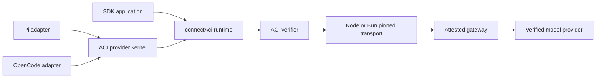

# ACI client architecture

This page is for maintainers building a new client or host adapter. It defines
the product boundary, component ownership, and the security contract every
supported integration must preserve.

## Design goal

An ACI client verifies the remote confidential workload before sending model
request bytes. That capability belongs in a shared transport and verifier, not
inside Pi, OpenCode, or any one SDK integration.

Normal HTTPS authenticates a domain. The ACI client additionally checks which
TEE workload is behind that domain, which keys it owns, which compose was
measured at launch, and whether the connection carrying plaintext is bound to
an attested key.

## Layers

| Layer | Responsibility | Must not own |
| --- | --- | --- |
| `@phala/aci-verifier` | Quote, nonce, keyset, measurement, expiry, channel, wire-digest, receipt, and session verification | Host auth UI, model persistence, or provider branding |
| `connectAci()` runtime | One origin-scoped verified connection and fetch implementation | Global TLS state or cross-origin pins |
| `@phala/aci-provider` | Connection lifecycle, catalog validation, TEE filtering, capabilities, receipt history, response verification, and structured inspection | Host credential storage or host-specific UI |
| Pi adapter | Pi Provider/Auth APIs, settings, commands, footer state, and native persistence | Independent verification or credential storage |
| OpenCode adapter | Server-plugin config, auth loader, models, commands, tools, and disposal | Independent verification or credential storage |
| Branded package | Provider ID, label, endpoint, environment names, accepted release policy, and optional account flow | A fork of the shared trust logic |

Applications that accept a custom `fetch` can use `connectAci()` directly.
Applications with a provider lifecycle should use the provider kernel. A host
that exposes neither boundary needs a local verified proxy; changing only its
base URL is not a native ACI integration.

## Shared trust contract

Every supported runtime path must:

1. Fetch a fresh nonce-bound report before model traffic.
2. Verify the hardware quote and the keyset digest bound into `report_data`.
3. Verify `sha256(app_compose)` against the RTMR3 `compose-hash` event.
4. Apply any configured accepted-compose policy.
5. Reject expired keysets.
6. Validate the destination hostname and require its observed TLS SPKI to
   appear in the attested keyset.
7. Apply `aci_verified` and accepted-session constraints before forwarding.
8. Capture the exact request and response wire digests needed for receipt
   verification.
9. Verify the signed receipt and cited session before completing a response
   when the host promises automatic response verification.
10. Fail closed on every required check, including cancellation races.

Pi and OpenCode enable response-completion receipt verification. The generic
provider defaults to on-demand verification so an embedding host can choose
the point at which it waits for the audit. `connectAci()` exposes the lower-level
transport and audit primitives without adding provider lifecycle.

Rust names reviewed compose hashes with repeatable `--accept-compose` flags.
TypeScript calls the same policy `acceptedComposeHashes`. Conformance tests
must keep those semantics aligned.

## Provider contracts

The provider kernel exposes four host-neutral contracts:

| Contract | Shared provider owns | Host adapter owns |
| --- | --- | --- |
| Lifecycle | Resolve policy, establish the verified connection, expose scoped fetch, and close it | Create and dispose the provider through native hooks |
| Model catalog | Validate `/v1/models`, filter, and map declared capabilities, prices, limits, and modalities | Convert `AciModel` into the host model type and persist selection |
| Account authorization | Describe a browser or device flow and return one API key plus optional metadata | Present the flow and persist the resulting credential |
| Inspection | Return structured status, attestation, receipt, and session results | Register native commands or tools and render the result |

A new adapter maps these contracts into official host APIs. It must not
reimplement attestation, device polling, receipt semantics, model inference, or
credential persistence.

## Catalog authority

The gateway catalog is the only source of model capabilities:

- `supported_features` controls reasoning and tool support;
- `supported_sampling_parameters` controls temperature support;
- required limits, modalities, prices, and capability arrays must validate;
- missing optional cache prices remain absent; and
- clients do not infer a model family or request dialect from the model ID.

Provider-specific reasoning dialects remain a gateway routing concern. Clients
use the gateway's normalized public reasoning fields.

## Runtime isolation

`connectAci()` is instance-scoped. Multiple providers can coexist without
sharing pins, connection state, credentials, model catalogs, or receipt
history.

Node uses an undici dispatcher scoped to the connection. Bun uses its native
TLS and proxy fetch options. Conditional package exports select the adapter;
all verification and policy logic above the TLS hook is shared.

Pi owns credentials, dynamic-catalog persistence, default-model persistence,
and provider lifecycle through its native APIs. OpenCode owns plugin
configuration and credential persistence. Neither adapter maintains a parallel
host state store.

## Release acceptance

Hardware proof does not identify an approved product release by itself:

- In **hardware-bound mode**, the client proves a genuine TDX workload owns
  the attested keys and reports its measured compose.
- In **reviewed-release mode**, the client also requires that compose hash to
  appear in a reviewed allowlist.

The report's repository and commit fields are self-declared labels. The compose
hash is the RTMR3-bound release anchor. RedPill and Phala deployment pipelines
must publish reviewed compose hashes through an authenticated channel and
allow a controlled overlap during rotation.

The remaining release loop is:

1. Review the source and complete deployment compose.
2. Produce the deterministic compose hash.
3. Publish it through an authenticated release channel.
4. Ship it in the branded client policy.
5. Exercise accepted and rejected measurements in Rust and TypeScript.

Publishing the npm packages does not, by itself, establish a reviewed-release
claim.

## Boundary of this architecture

The local host sees plaintext. This architecture protects the remote model
HTTP path. MCP servers, tools, browser automation, shell commands, WebSockets,
extensions, and host telemetry require their own threat models.
